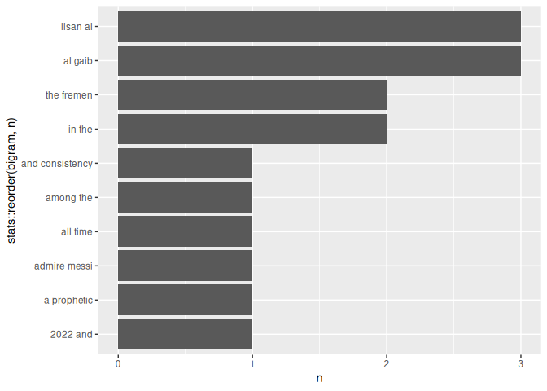

<!-- README.md is generated from README.Rmd. Please edit that file -->

# tobitext

<!-- badges: start -->

<!-- badges: end -->

`tobitext` is a small R package for simple text analysis workflows. It
helps users tokenize text, create bigrams, and visualize the most common
bigrams using a tidytext style workflow.

## Installation

You can install the development version of `tobitext` from GitHub with:

``` r
# install.packages("devtools")
devtools::install_github("ADC-405-S26/Tokenization-and-Bigrams-Explore-Package")
```

## Why tobitext?

Modern large language models (LLMs) and NLP systems are fundamentally
built on token based text processing. Before models can understand or
generate language, text first needs to be broken into smaller units such
as words, tokens, or n-grams.

`tobitext` focuses on introducing these foundational NLP concepts
through a simple and beginner friendly workflow in R. The package is
designed for students and early learners who want to explore how
tokenization and bigram analysis work before moving into more advanced
machine learning or language modeling tasks.

The package focuses on three core ideas:

- tokenizing text into individual words
- creating bigrams and n-grams
- identifying repeated language patterns

These workflows are commonly used in:

- text mining
- sentiment analysis
- topic discovery
- search engines
- recommendation systems
- chatbot and LLM preprocessing
- predictive text systems

## Load the package

``` r
library(tobitext)
```

## Example dataset

The package includes a small dataset called `sample_text` containing
short text passages about Lionel Messi and Lisan al Gaib from Dune.

``` r
sample_text
#>   id
#> 1  1
#> 2  2
#>                                                                                                                                                                                                                                                                                                                          text
#> 1                        Lionel Messi is widely considered one of the greatest football players of all time. Messi helped Argentina win the FIFA World Cup in 2022 and won multiple Ballon dOr awards during his career. Many football fans admire Messi for his dribbling, creativity, and consistency in important matches.
#> 2 Lisan al Gaib is a prophetic figure in the Dune universe created by Frank Herbert. The Fremen believe Lisan al Gaib will lead them to freedom and transform the future of Arrakis. In the story, Paul Atreides gradually becomes associated with the legend of Lisan al Gaib as he gains influence among the Fremen people.
```

## Tokenize words

Tokenization is one of the first steps in NLP workflows. The
`tokenize_words()` function breaks text into individual word level
observations.

This process helps transform raw text into structured data that can
later be used for:

- word frequency analysis
- text classification
- sentiment analysis
- machine learning workflows
- LLM preprocessing

``` r
tokens <- tokenize_words(sample_text, "text")

head(tokens, 10)
#>    id
#> 1   1
#> 2   1
#> 3   1
#> 4   1
#> 5   1
#> 6   1
#> 7   1
#> 8   1
#> 9   1
#> 10  1
#>                                                                                                                                                                                                                                                                                                    text
#> 1  Lionel Messi is widely considered one of the greatest football players of all time. Messi helped Argentina win the FIFA World Cup in 2022 and won multiple Ballon dOr awards during his career. Many football fans admire Messi for his dribbling, creativity, and consistency in important matches.
#> 2  Lionel Messi is widely considered one of the greatest football players of all time. Messi helped Argentina win the FIFA World Cup in 2022 and won multiple Ballon dOr awards during his career. Many football fans admire Messi for his dribbling, creativity, and consistency in important matches.
#> 3  Lionel Messi is widely considered one of the greatest football players of all time. Messi helped Argentina win the FIFA World Cup in 2022 and won multiple Ballon dOr awards during his career. Many football fans admire Messi for his dribbling, creativity, and consistency in important matches.
#> 4  Lionel Messi is widely considered one of the greatest football players of all time. Messi helped Argentina win the FIFA World Cup in 2022 and won multiple Ballon dOr awards during his career. Many football fans admire Messi for his dribbling, creativity, and consistency in important matches.
#> 5  Lionel Messi is widely considered one of the greatest football players of all time. Messi helped Argentina win the FIFA World Cup in 2022 and won multiple Ballon dOr awards during his career. Many football fans admire Messi for his dribbling, creativity, and consistency in important matches.
#> 6  Lionel Messi is widely considered one of the greatest football players of all time. Messi helped Argentina win the FIFA World Cup in 2022 and won multiple Ballon dOr awards during his career. Many football fans admire Messi for his dribbling, creativity, and consistency in important matches.
#> 7  Lionel Messi is widely considered one of the greatest football players of all time. Messi helped Argentina win the FIFA World Cup in 2022 and won multiple Ballon dOr awards during his career. Many football fans admire Messi for his dribbling, creativity, and consistency in important matches.
#> 8  Lionel Messi is widely considered one of the greatest football players of all time. Messi helped Argentina win the FIFA World Cup in 2022 and won multiple Ballon dOr awards during his career. Many football fans admire Messi for his dribbling, creativity, and consistency in important matches.
#> 9  Lionel Messi is widely considered one of the greatest football players of all time. Messi helped Argentina win the FIFA World Cup in 2022 and won multiple Ballon dOr awards during his career. Many football fans admire Messi for his dribbling, creativity, and consistency in important matches.
#> 10 Lionel Messi is widely considered one of the greatest football players of all time. Messi helped Argentina win the FIFA World Cup in 2022 and won multiple Ballon dOr awards during his career. Many football fans admire Messi for his dribbling, creativity, and consistency in important matches.
#>          word
#> 1      lionel
#> 2       messi
#> 3          is
#> 4      widely
#> 5  considered
#> 6         one
#> 7          of
#> 8         the
#> 9    greatest
#> 10   football
```

## Create bigrams

Bigrams are 2 word combinations that help capture relationships between
words instead of viewing each word independently.

For example, the phrase `"world cup"` contains more meaning together
than the individual words `"world"` and `"cup"` separately.

Bigram analysis is commonly used in:

- predictive text systems
- search query analysis
- phrase detection
- recommendation systems
- language modeling

``` r
bigrams <- create_bigrams(sample_text, "text")

head(bigrams, 10)
#>    id
#> 1   1
#> 2   1
#> 3   1
#> 4   1
#> 5   1
#> 6   1
#> 7   1
#> 8   1
#> 9   1
#> 10  1
#>                                                                                                                                                                                                                                                                                                    text
#> 1  Lionel Messi is widely considered one of the greatest football players of all time. Messi helped Argentina win the FIFA World Cup in 2022 and won multiple Ballon dOr awards during his career. Many football fans admire Messi for his dribbling, creativity, and consistency in important matches.
#> 2  Lionel Messi is widely considered one of the greatest football players of all time. Messi helped Argentina win the FIFA World Cup in 2022 and won multiple Ballon dOr awards during his career. Many football fans admire Messi for his dribbling, creativity, and consistency in important matches.
#> 3  Lionel Messi is widely considered one of the greatest football players of all time. Messi helped Argentina win the FIFA World Cup in 2022 and won multiple Ballon dOr awards during his career. Many football fans admire Messi for his dribbling, creativity, and consistency in important matches.
#> 4  Lionel Messi is widely considered one of the greatest football players of all time. Messi helped Argentina win the FIFA World Cup in 2022 and won multiple Ballon dOr awards during his career. Many football fans admire Messi for his dribbling, creativity, and consistency in important matches.
#> 5  Lionel Messi is widely considered one of the greatest football players of all time. Messi helped Argentina win the FIFA World Cup in 2022 and won multiple Ballon dOr awards during his career. Many football fans admire Messi for his dribbling, creativity, and consistency in important matches.
#> 6  Lionel Messi is widely considered one of the greatest football players of all time. Messi helped Argentina win the FIFA World Cup in 2022 and won multiple Ballon dOr awards during his career. Many football fans admire Messi for his dribbling, creativity, and consistency in important matches.
#> 7  Lionel Messi is widely considered one of the greatest football players of all time. Messi helped Argentina win the FIFA World Cup in 2022 and won multiple Ballon dOr awards during his career. Many football fans admire Messi for his dribbling, creativity, and consistency in important matches.
#> 8  Lionel Messi is widely considered one of the greatest football players of all time. Messi helped Argentina win the FIFA World Cup in 2022 and won multiple Ballon dOr awards during his career. Many football fans admire Messi for his dribbling, creativity, and consistency in important matches.
#> 9  Lionel Messi is widely considered one of the greatest football players of all time. Messi helped Argentina win the FIFA World Cup in 2022 and won multiple Ballon dOr awards during his career. Many football fans admire Messi for his dribbling, creativity, and consistency in important matches.
#> 10 Lionel Messi is widely considered one of the greatest football players of all time. Messi helped Argentina win the FIFA World Cup in 2022 and won multiple Ballon dOr awards during his career. Many football fans admire Messi for his dribbling, creativity, and consistency in important matches.
#>               bigram
#> 1       lionel messi
#> 2           messi is
#> 3          is widely
#> 4  widely considered
#> 5     considered one
#> 6             one of
#> 7             of the
#> 8       the greatest
#> 9  greatest football
#> 10  football players
```

## Plot top bigrams

The `plot_top_bigrams()` function visualizes the most common bigrams in
the dataset.

Finding repeated bigrams helps identify important themes, repeated
phrases, and dominant language patterns within text data.

This type of analysis is often used in:

- news and article analysis
- social media mining
- customer review analysis
- topic exploration
- trend detection

``` r
plot_top_bigrams(bigrams, n = 10)
```



## Package functions

`tobitext` currently includes:

- `tokenize_words()`
- `create_bigrams()`
- `plot_top_bigrams()`
